<h1>SPOTIFY DATA ENGINEER PROJECT</h1>

1.  **Problem Statement**

This project will ingest data from Spotify API into AWS S3 as raw files.
Afterward, This dataset will be transformed into readable format and
stored in another storage. Finally, this transformed data will be loaded
into data warehouse Snowflake for analysis or building machine learning
models purposes.

All processes must be automated.

2.  **Diagram of this project**

3.  **Process**

    1.  **Ingest data from Spotify API**

Firstly, we need to register an account for developer on Spotify website

[[https://developer.spotify.com/]](https://developer.spotify.com/dashboard)

After creating the app, we need to store Client ID and Client Secret
information, it will be used to connect between AWS Lambda and Spotify
API to get data sources.

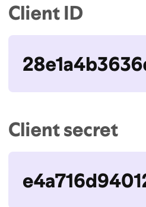

Secondly, we need to register an AWS account and create an AWS Bucket,
this bucket will be used to store raw data files.

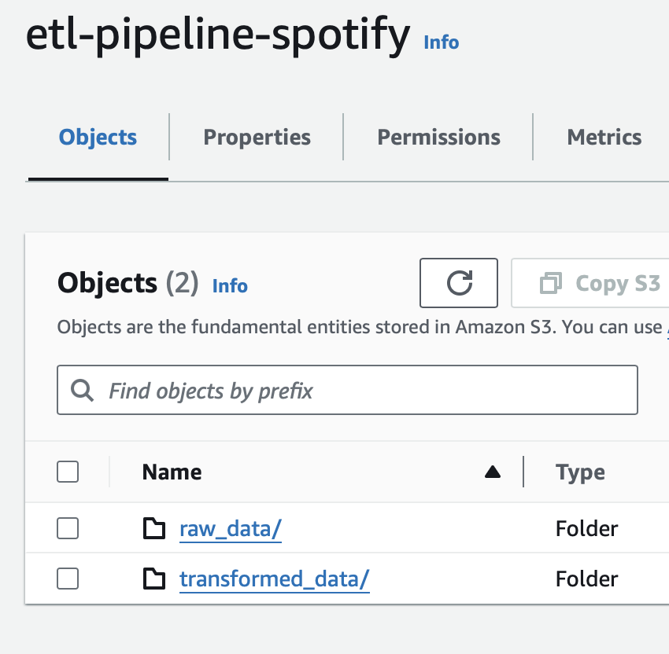

Thirdly, we prepare the AWS Lambda function to connect to the Spotify
API and get data sources. The **client_id** and **client_secret** must
be defined in **Environment
Variables**.
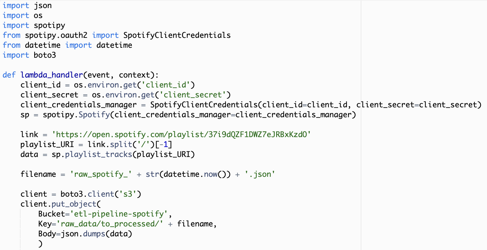

After reading and storing data from Spotify API, we will trigger the
transformation Glue Job (in point 3.2) by the following code:

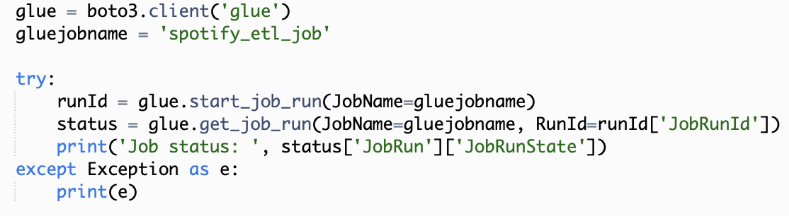

We will use EventBridge (CloudWatch) to set a schedule to execute the
Lambda function. In this project, I set it daily, so the data sources
from Spotify API will be ingested into AWS S3 everyday.

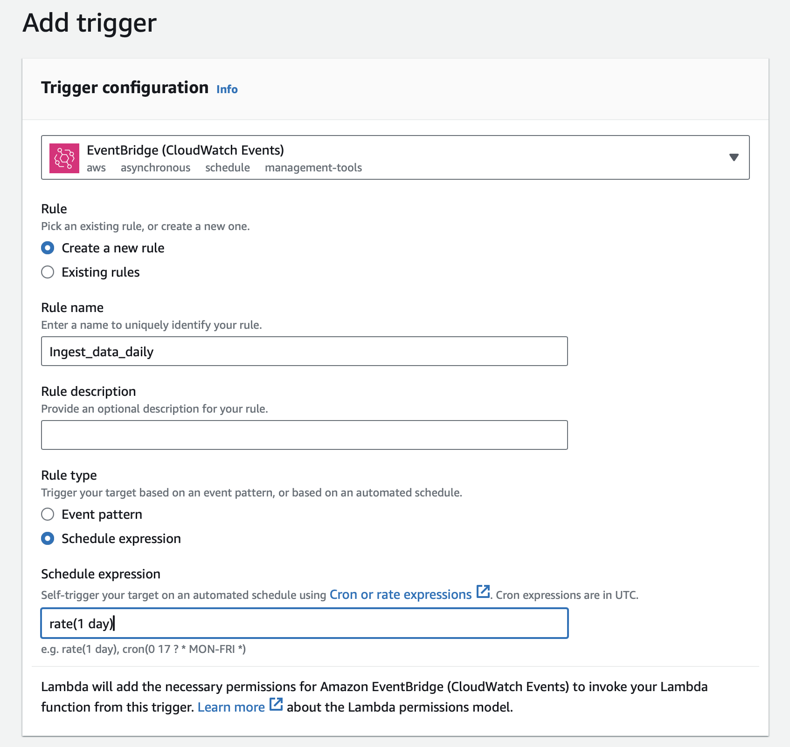

2.  **Transform raw data file into readable data**

In this step, we will use AWS Glue for the transformation step in the
ETL process.

In AWS Glue, we can create Notebook to process data step by step, it
will be automatically converted into a script.

Firstly, we need to import some necessary libraries, then continue with
initializing SparkContext and GlueContext. They are some kinds of
protocol that we use to connect with Spark and Glue. Afterward, we read
the raw file (json) in S3 and convert it to Dataframe.

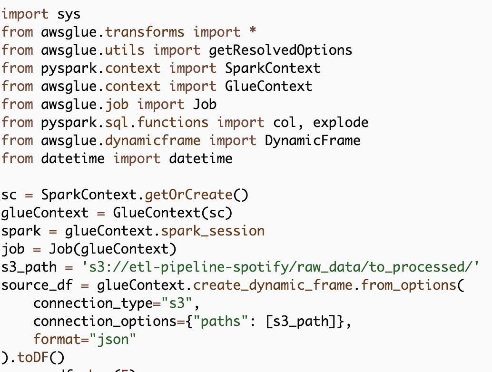

We will need some functions to process data for corresponding tables.

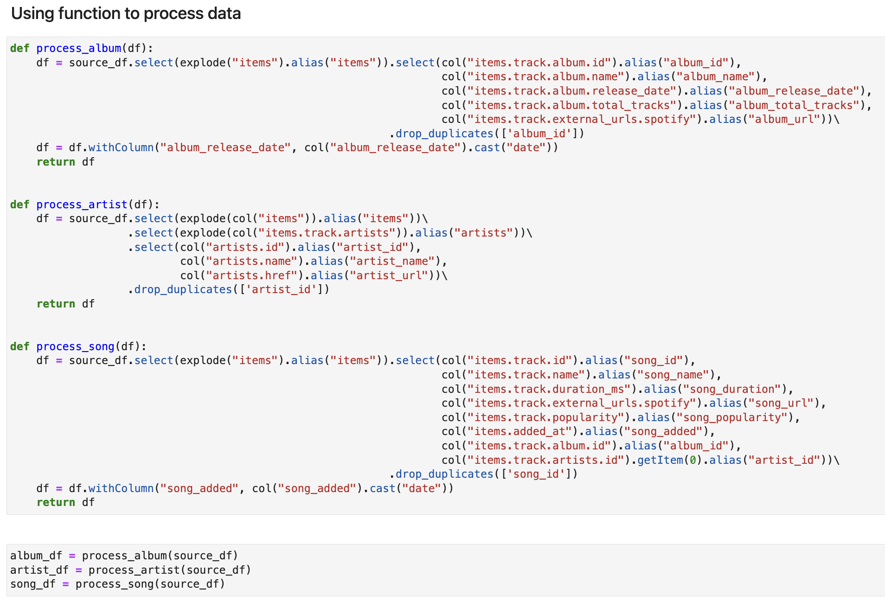

Finally, we write the Dataframes into CSV files and store them in AWS
S3.

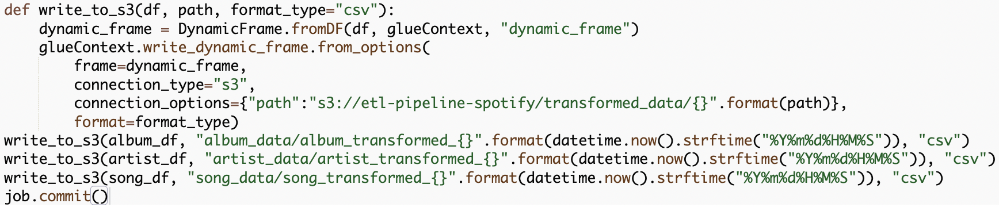

Do not forget to commit the job at the end.

We need to run this job to make sure it works well before setting it to
run automatically by the Schedule feature of Glue.

We do not need to set the Schedule for the Glue job if we need it to run
followed by the Ingest step (3.1) as in the 3.1 step, we set the Glue
job to be triggered whenever the Lambda function is called.

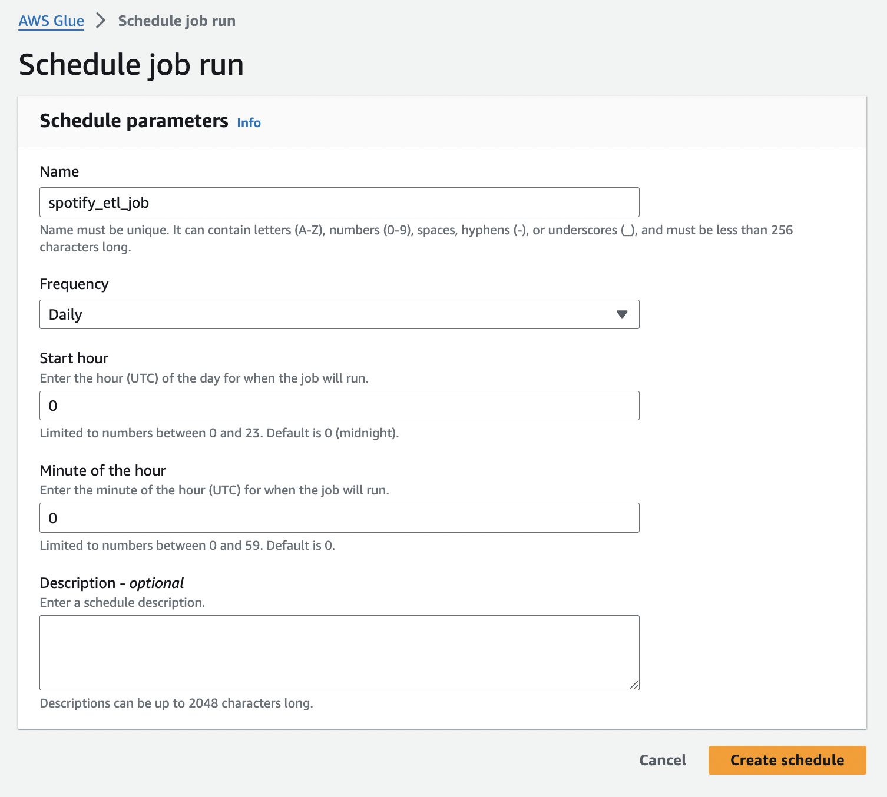

3.  **Loading transformed data into Data Warehouse (Snowflake database)**

The most important thing to load data from AWS S3 to the external
platform, in this project is the Data Warehouse Snowflake, is to create
a secure connection between AWS and this external platform.

-   Create an IAM role with the S3 Access right.

-   In Snowflake, create an INTEGRATION with STORAGE_AWS_ROLE_ARN contains information from ARN of the IAM role above.

-   When the INTEGRATION was created, take the information of STORAGE_AWS_IAM_USER_ARN and STORAGE_AWS_EXTERNAL_ID.

-   Paste them back the Trust Policy of the IAM Role.

-   Now the Snowflake Data Warehouse can connect to AWS S3 to get data.

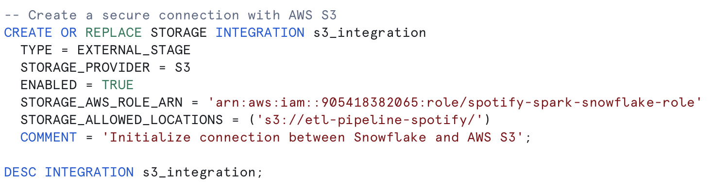

In the next step, we will create a file format corresponding to the
files in AWS S3 which will be loaded into Snowflake.

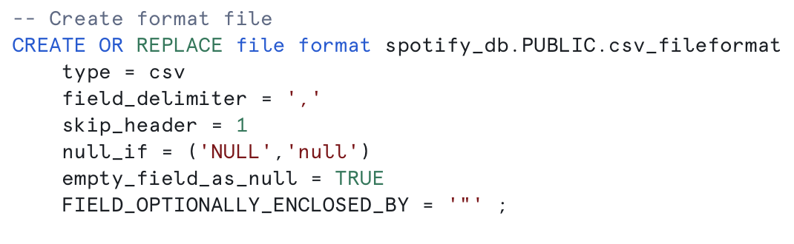

The final step in the preparation process is to create an INTEGRATION,
which is considered as a storage to store data from AWS S3.

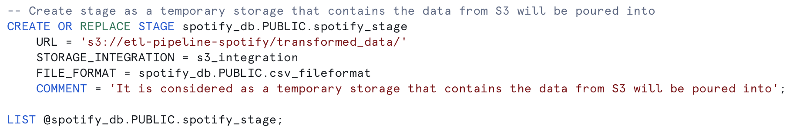

After the preparation steps are done, we will start to define the
necessary tables with the structures corresponding to the data files in
AWS S3.

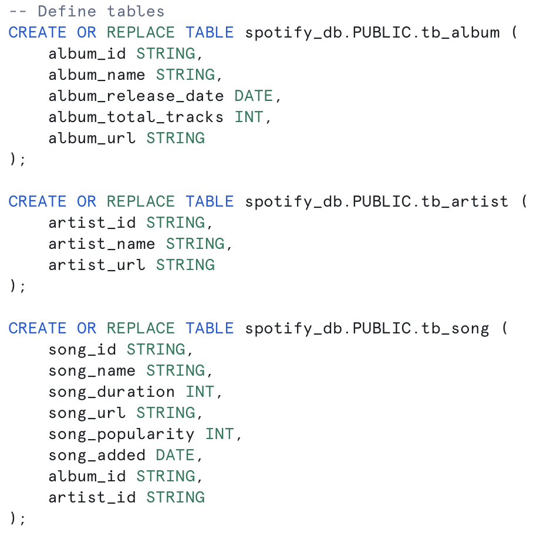

We can try to test by manually loading data into those tables to ensure
the connection and the table structures were created correctly.

Finally, we create Snowpipe which is used to load data automatically
from AWS S3 to Snowflake whenever a new file is uploaded into AWS S3.

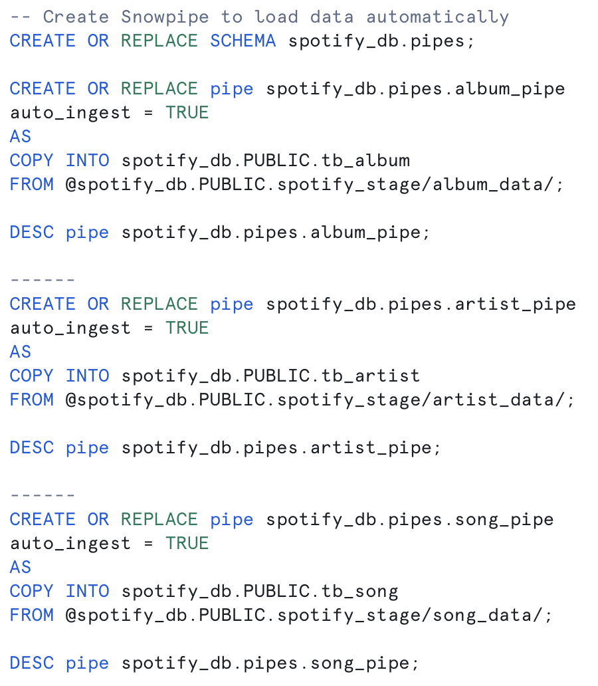

There is one more step that needs to be configured for automatic loading
data is to create an Event in AWS S3. We will use SQS queue with
information from the notification_channel of the corresponding
Snowpipe.
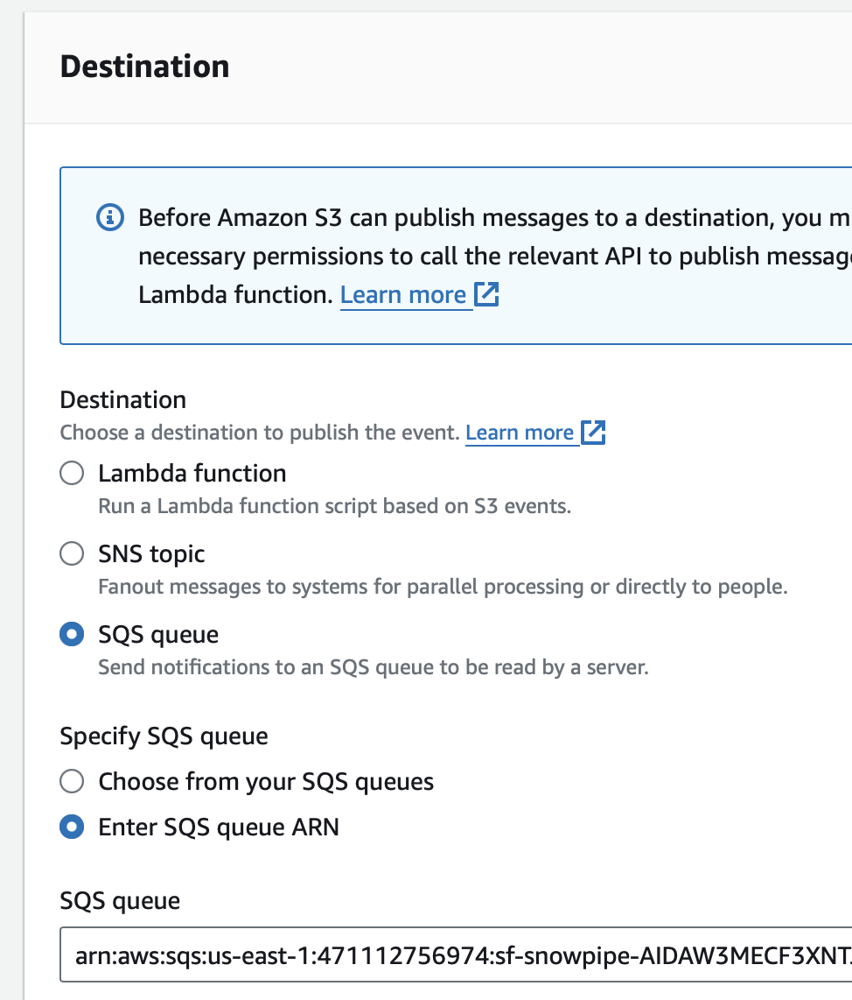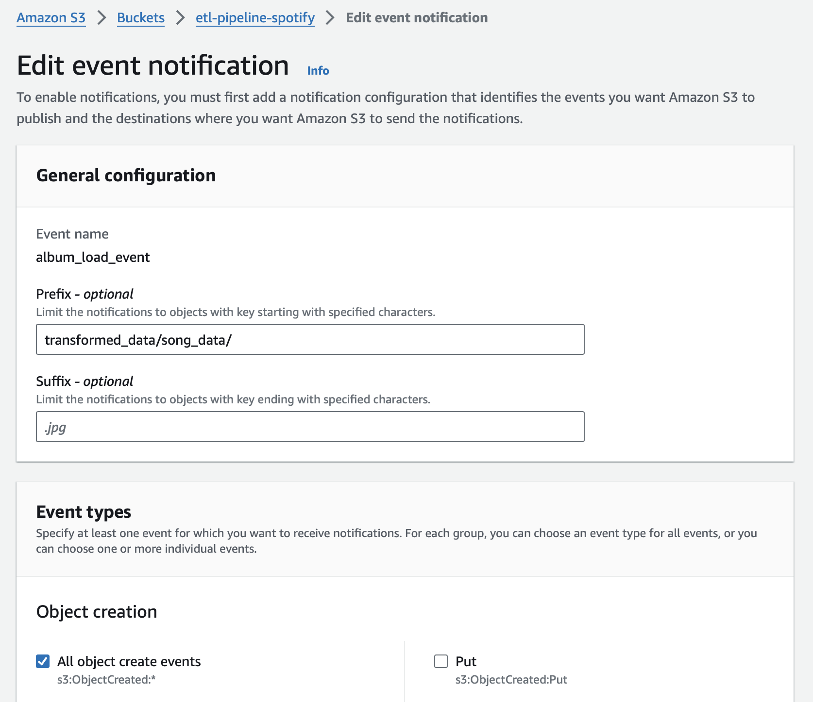
